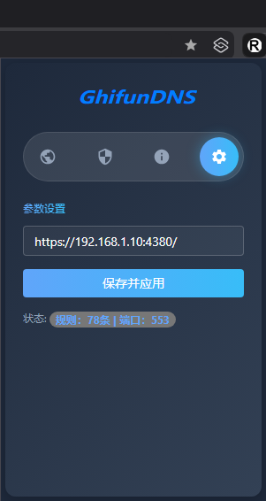

# Chrome浏览器插件

## 界面

<!--  -->

<div style="display: flex; gap: 10px;">
  
  
</div>

**如何使用**

在程序的配置文件 Config.ini 中找到以下配置参数

```
# 设置本机Bypass服务地址[多个以逗号分隔]
BYPASS_ADDR              = :80,:443,:553
```

下载用于Chrome浏览器的插件：  
[https://raw.githubusercontent.com/BillGhifun/gogdns-update/main/tools/crx/gogdns.crx](https://raw.githubusercontent.com/BillGhifun/gogdns-update/main/tools/crx/gogdns.crx)


插件安装后，在Chrome浏览器的插件管理中，找到插件并启用。