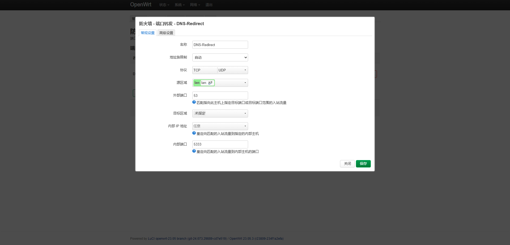

# 安装

<!-- This page demonstrates some of the built-in markdown extensions provided by VitePress. -->

## 程序目录结构

<!-- gogdns/ *根目录*   
├── config/ *改写配置文件*   
├── db/ *数据库*   
├── group/ *分组改写列表*   
├── www/ *前端*   
├── cert/ *证书文件夹*   
├── Config.ini *程序配置文件*   
└── gogdns *主程序*    -->

| 名称 | 功能 |
|------|:----:|
| `config/` | *规则* |
| `db/` | *数据库* |
| `group/` | *分组列表* |
| `www/` | *网页文件* |
| `cert/` | *证书* |
| `Config.ini` | *程序配置文件* |
| `gogdns` | *主程序* |

## Windows

直接执行二进制程序。

## Linux

直接执行二进制程序。

## Docker

```
docker run -d --name gogdns --cap-add=NET_BIND_SERVICE --restart=unless-stopped -p 5380:5380/tcp -p 4380:4380/tcp -p 53:53/tcp -p 53:53/udp --net=host -v /etc/localtime:/etc/localtime -v /path/gogdns:/gogdns/workstation billghifun/gogdns:test-alpha
```

## OpenWRT

```plaintext
# 首先把程序及所需文件复制到系统根目录
/gogdns
```

**!*注: 为防止与OpenWRT内建DNS服务器的端口冲突，需要对GOGDNS配置文件中的参数SERVER_UDP_ADDR与SERVER_TCP_ADDR服务端口改为非53端口。**

```plaintext
# 建立脚本文件
/etc/init.d/gogdns
```

```bash
#!/bin/sh /etc/rc.common
# GOGDNS service management script

START=50
STOP=89

PROG="/gogdns/gogdns_amd64_linux"
PIDFILE="/var/run/gogdns.pid"
LOG_FILE="/var/log/gogdns.log"

boot() {
    start
}

start() {
    echo "Starting GOGDNS service..."
    
    # 检查是否已经在运行
    if [ -f "$PIDFILE" ] && kill -0 $(cat "$PIDFILE") 2>/dev/null; then
        echo "GOGDNS is already running (PID: $(cat $PIDFILE))"
        return 1
    fi
    
    # 清理旧的日志文件
    > "$LOG_FILE" 2>/dev/null || true
    
    # 使用重定向和后台运行，不使用nohup
    $PROG > "$LOG_FILE" 2>&1 &
    
    # 保存PID
    PID=$!
    echo $PID > "$PIDFILE"
    echo "GOGDNS service started with PID $PID"
    
    # 等待一下确认进程确实启动
    sleep 2
    if kill -0 $PID 2>/dev/null; then
        echo "GOGDNS started successfully"
        return 0
    else
        echo "GOGDNS may have failed to start, check $LOG_FILE for details"
        rm -f "$PIDFILE"
        return 1
    fi
}

stop() {
    echo "Stopping GOGDNS service..."
    
    # 首先尝试通过PID文件停止
    if [ -f "$PIDFILE" ]; then
        PID=$(cat "$PIDFILE")
        if kill -0 $PID 2>/dev/null; then
            # 先尝试正常终止
            kill $PID 2>/dev/null && echo "Sent TERM signal to PID $PID"
            
            # 等待3秒让进程正常退出
            for i in $(seq 1 3); do
                if kill -0 $PID 2>/dev/null; then
                    sleep 1
                else
                    break
                fi
            done
            
            # 如果进程还在运行，强制杀死
            if kill -0 $PID 2>/dev/null; then
                kill -9 $PID 2>/dev/null && echo "Forcefully killed PID $PID"
            fi
        fi
        rm -f "$PIDFILE"
    fi
    
    # 确保所有同名进程都被杀死
    PIDS=$(ps | grep "$(basename "$PROG")" | grep -v grep | awk '{print $1}' 2>/dev/null || true)
    if [ -n "$PIDS" ]; then
        echo "Killing remaining processes: $PIDS"
        for pid in $PIDS; do
            kill -9 $pid 2>/dev/null || true
        done
    fi
    
    echo "GOGDNS service stopped"
}

restart() {
    stop
    sleep 2
    start
}

status() {
    if [ -f "$PIDFILE" ]; then
        PID=$(cat "$PIDFILE")
        if kill -0 $PID 2>/dev/null; then
            echo "GOGDNS is running with PID $PID"
            echo "Log file: $LOG_FILE"
            return 0
        else
            echo "PID file exists but process $PID not found"
            rm -f "$PIDFILE"
            return 1
        fi
    else
        # 检查是否在其他地方运行
        PIDS=$(ps | grep "$(basename "$PROG")" | grep -v grep | awk '{print $1}' 2>/dev/null || true)
        if [ -n "$PIDS" ]; then
            echo "GOGDNS is running without PID file (PIDs: $PIDS)"
            return 0
        else
            echo "GOGDNS is not running"
            return 3
        fi
    fi
}
```

```bash
# 系统启动时运行
/etc/init.d/gogdns enable

# 启动服务
/etc/init.d/gogdns start

# 重启服务
/etc/init.d/gogdns restart

# 停止服务
/etc/init.d/gogdns stop

# 查看状态
/etc/init.d/gogdns status

# 检查是否启用成功
/etc/init.d/gogdns enabled && echo "Enabled" || echo "Disabled"

# 查看rc.d目录的链接
ls -la /etc/rc.d/S*gogdns*

```

**端口转发设置**




<!-- ## More

Check out the documentation for the [full list of markdown extensions](https://vitepress.dev/guide/markdown). -->
