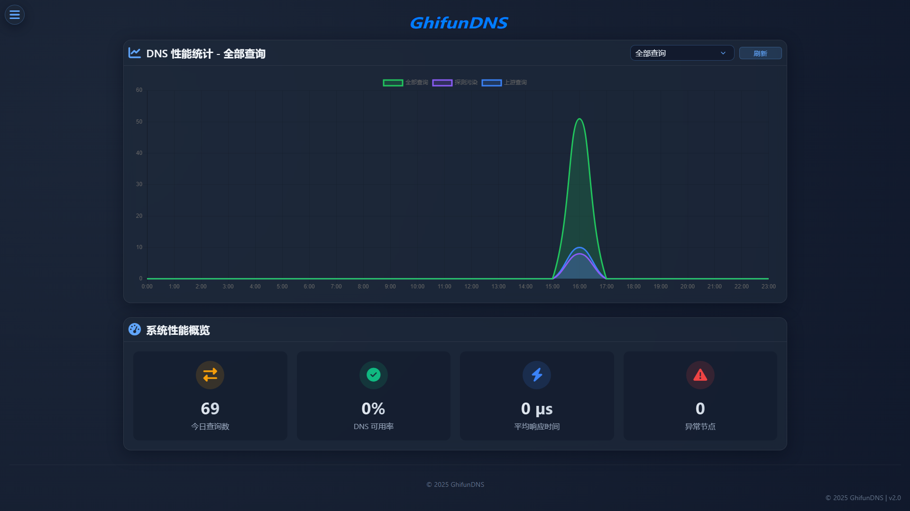

# 统计

<!-- This page demonstrates some of the built-in markdown extensions provided by VitePress. -->

## 界面

<!-- VitePress provides Syntax Highlighting powered by [Shiki](https://github.com/shikijs/shiki), with additional features like line-highlighting: -->

**功能**

用于查看客户端请求可视化数据。

<!-- ## More

Check out the documentation for the [full list of markdown extensions](https://vitepress.dev/guide/markdown). -->
