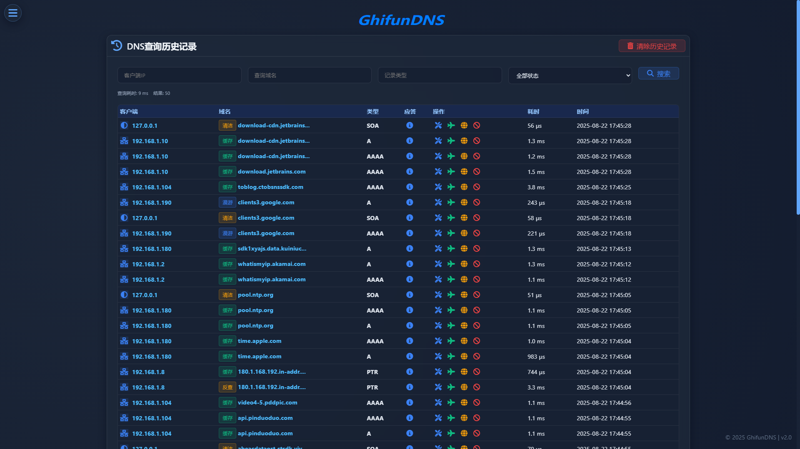

# 历史记录

<!-- This page demonstrates some of the built-in markdown extensions provided by VitePress. -->

## 界面

<!-- VitePress provides Syntax Highlighting powered by [Shiki](https://github.com/shikijs/shiki), with additional features like line-highlighting: -->

<!-- https://vitepress.dev/zh/reference/default-theme-config#docfooter -->
<!-- https://github.com/vuejs/vitepress/blob/main/types/default-theme.d.ts -->

**功能**

查询请求历史记录。

<!-- ## More

Check out the documentation for the [full list of markdown extensions](https://vitepress.dev/guide/markdown). -->
