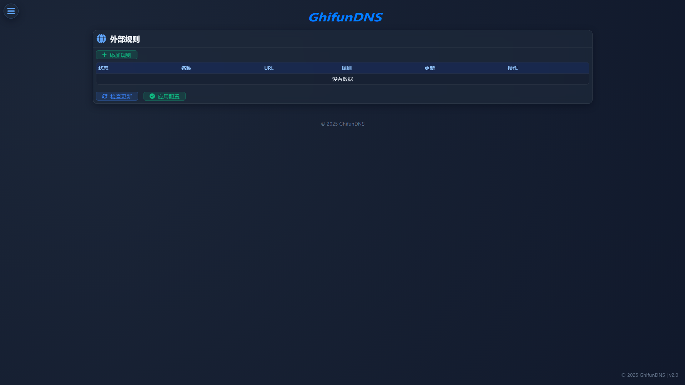

# 外部列表

<!-- This page demonstrates some of the built-in markdown extensions provided by VitePress. -->

## 界面

<!-- VitePress provides Syntax Highlighting powered by [Shiki](https://github.com/shikijs/shiki), with additional features like line-highlighting: -->

**功能**

可拉取互联网分享的规则（支持Hosts、域名通配符、Adblock语法）。

<!-- ## More

Check out the documentation for the [full list of markdown extensions](https://vitepress.dev/guide/markdown). -->
