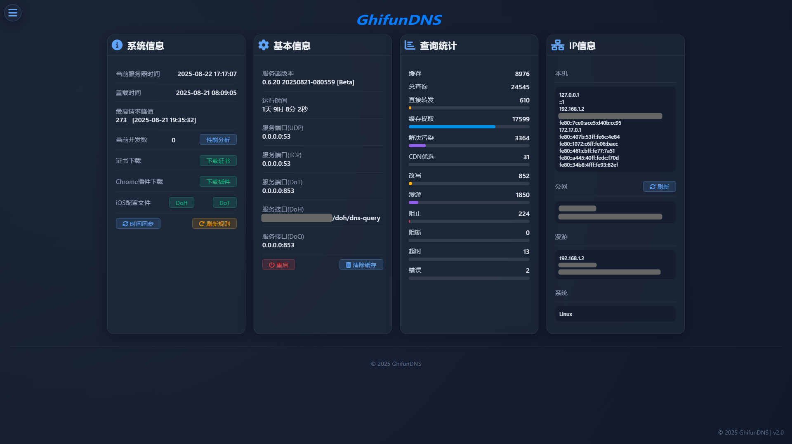

# 首页

<!-- This page demonstrates some of the built-in markdown extensions provided by VitePress. -->

## 界面

<!-- VitePress provides Syntax Highlighting powered by [Shiki](https://github.com/shikijs/shiki), with additional features like line-highlighting: -->

**功能**

1. **主面板**

展示实时系统状态及关键性能指标。

2. **历史记录**

记录所有客户端请求的详细信息。

3. **规则**

自定义查询处理规则。

4. **分组阻止列表**

为不同APP设置独立的拦截策略。

5. **外部Hosts**

可添加DNS广告屏蔽规则。

6. **查询统计**

数据查询报表。

7. **客户端列表**

显示设备名称/IP/MAC地址。

8. **高级设置**

运行服务器内置的命令与服务器同步。

9. **日志**

服务器各项日志。

10. **统计**

数据可视化视图。

11. **工具**

DNS查询测试工具。

<!-- ## More

Check out the documentation for the [full list of markdown extensions](https://vitepress.dev/guide/markdown). -->
