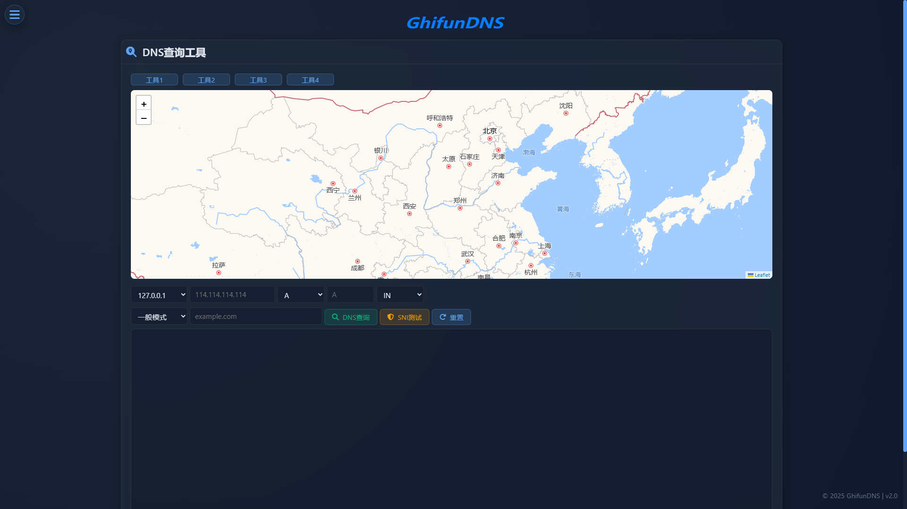

# 工具

<!-- This page demonstrates some of the built-in markdown extensions provided by VitePress. -->

## 界面

<!-- VitePress provides Syntax Highlighting powered by [Shiki](https://github.com/shikijs/shiki), with additional features like line-highlighting: -->

**功能**

1. **DNS测试工具**

提供多种方式的DNS查询。

2. **IP归属查询工具**

用于查询IP地址的地理位置。

3. **SNI测试工具**

用于测试SNI状态。

<!-- ## More

Check out the documentation for the [full list of markdown extensions](https://vitepress.dev/guide/markdown). -->
